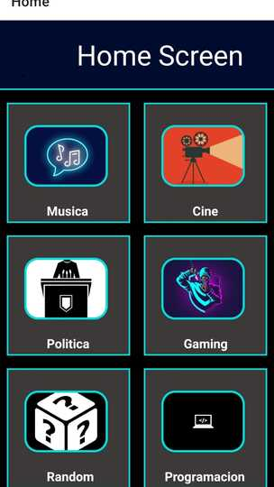
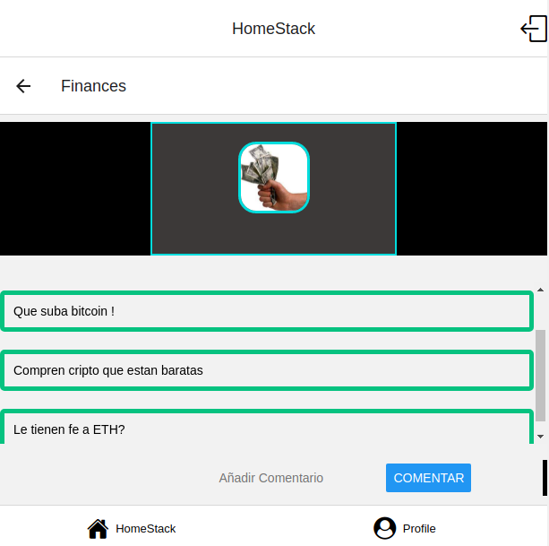
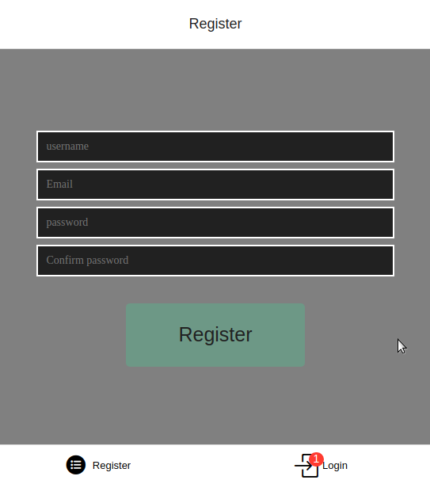
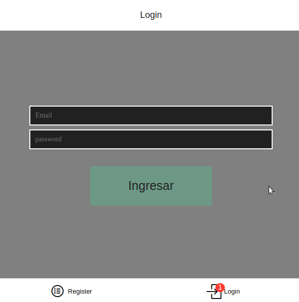
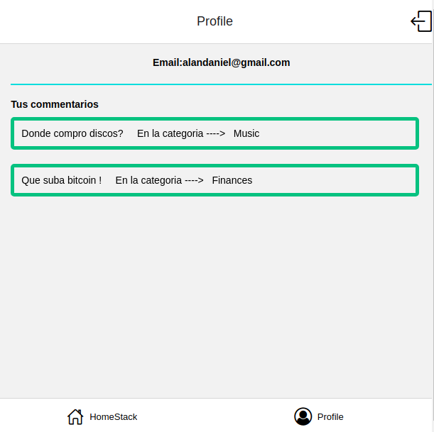

## ChatRoom para dispositivos mobiles creado con React-Native 

-Sitio web creado para el curso de React Native .
-5º curso de la capacitacion FullStack. 

## Construido con:

-React-Native
-Redux
-Css
-Boostrap 
-Firebase
-Expo

## Features:
-Autenticacion de usuarios con Firebase Authenticator
-Navegacion entre vistas con react navigation
-Manejo de states con Redux
-Persistencia de datos en Firebase

## Capturas:

> Home View
## --

> Toppic View
## --

>Register 
##

>Login 
##

>Profile

## Proximas features:
-TimeStamp a los comentarios 
-Like a comentarios
